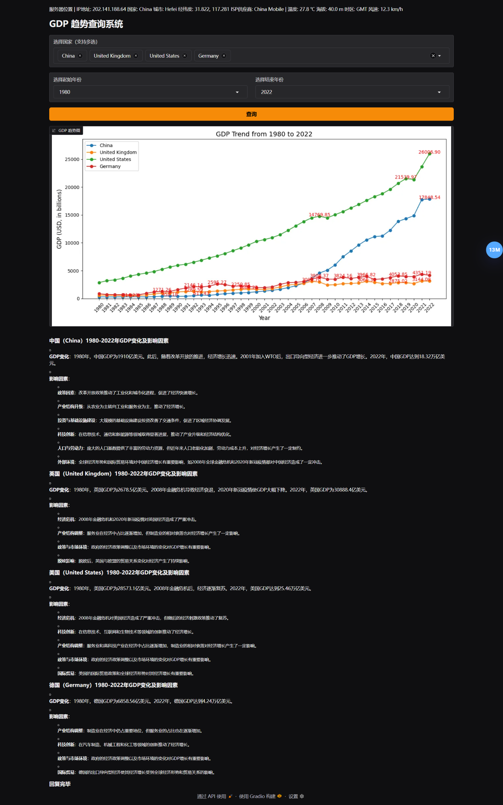
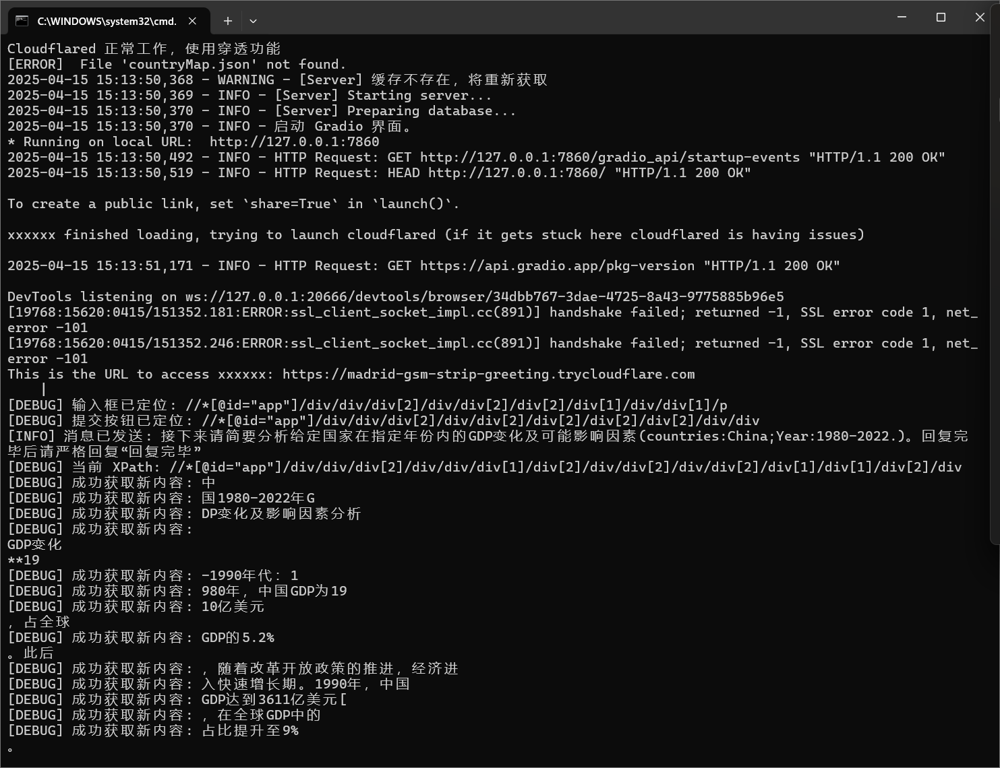
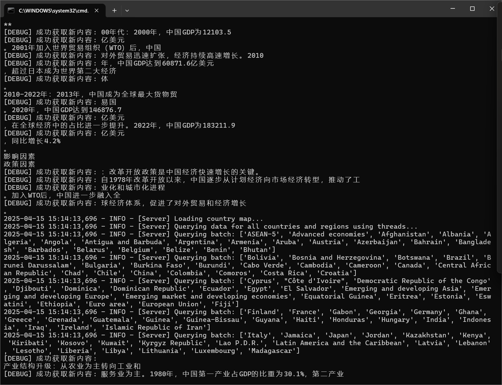
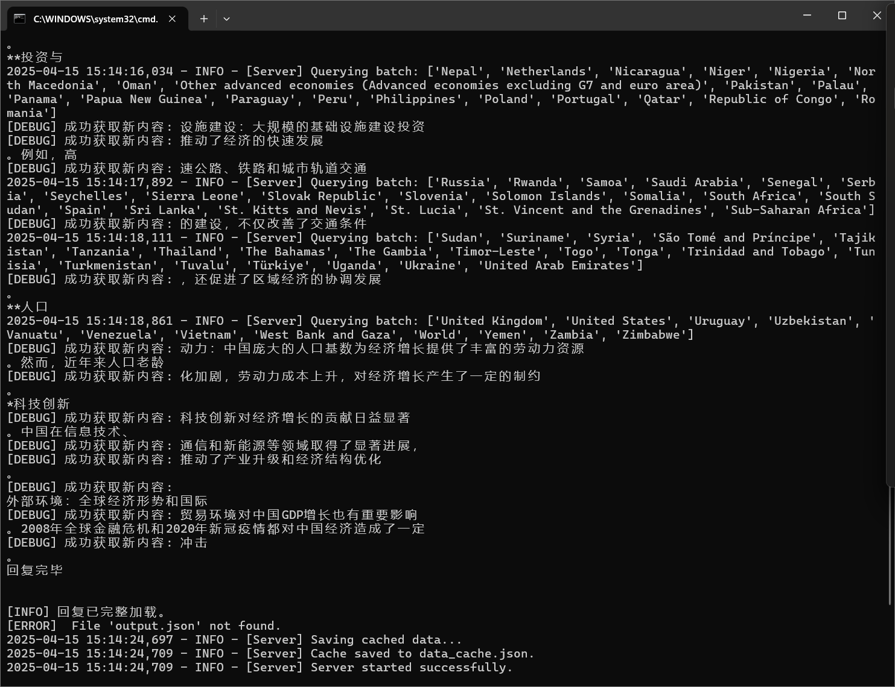

代码中为了不覆盖掉提交记录就没有在目录结构上分层（还有一个原因是`python`分层后获取上级目录类的方式有点丑陋），可以按下面这个结构去理解代码（运行示例请看下文）

```sh
.
├── AutoRun.bat
├── Main.py
├── README.md
├── helper
│   ├── Config.py
│   └── jsonIO.py
├── server
│   ├── Server.py
│   ├── data
│   ├── server.log
│   └── worker
│       ├── Crawler.py
│       └── QueryCore.py
├── test
│   ├── test.md
│   └── testAI.ipynb
├── use_cloudflare_tunnel.py
└── webui
    ├── AiModule.py
    └── WebUI.py
```

---

这是一个为深度学习实践课程第二次小作业自主实现的小程序，结合了`IP`地址查询、天气查询、历年`GDP`数据趋势（对比）图（支持年份自选（选择起始年份后，终止年份自动顺延）、国家多选）展示与`AI`分析功能，支持内网穿透、一键启动，所有功能均使用免费、免登录接口

其中内网穿透功能借助`cloudflare`，详情见`use_cloudflare_tunnel.py`文件与`AutoRun.bat`（`Linux`使用时可仿照其编写一个简单`sh`脚本，这里不再演示）

`IP`地址与天气数据借助`request`库直接调用`API`，默认展示服务器数据（而非客户端，获取客户端`IP`需要引入更复杂的功能，这些展示并非主要目的，后续如果引入获取用户`IP`的手段这里稍微改一下就好（已经预留好接口了））

`GDP`数据从缓存中读出，绘图后返回前端展示，同时国家名与年份数据会发送给`Kimi`并在最下方展示`Kimi`回复

若缓存中无数据，服务器会自动从网站上爬取（借助`request+lxml`），无需手动填充

---

`AI`部分是参考了之前做的一个法律助手`RAG`，理论上这个程序也可以做成一个`RAG`，但是工程量会超出当前小作业的要求（虽然目前来看似乎也已经超出了），而且“免费、免登录”情况下无法附带太长的数据，只能提供简单`prompt`

为了实现免费、免登录的功能，这里使用`selenium`模拟真实浏览器在后台与`Kimi`交互，用户点击查询后请求自动发送，每次问答延迟在十秒内。~~还有一个原因是我的 dashscope 免费 API 过期了~~

实际上这里可以将`AI`模块提取出来放到单独进程中，以实现前端流式输出（或暴力点直接修改`AI`模块的逻辑，每次都输出到文件中，前端检查有无新数据并决定是否更新），后端已经实现流式输出

后续如果不再追求免费，可以修改这一部分为`API`调用，开发与维护难度会降低很多，性能也可以有提升；同时还可以引入数据库来作为缓存（不过这里数据量比较小，可以全部存在内存里）；目前来说前后端还是有些耦合（体现在前端直接持有后端实例），如果想更分离一点可以用`Flask`框架给后端包一下，然后改改前端调用逻辑

---



例如下面是一次无缓存服务器启动过程

<div style="display: flex; justify-content: space-around; align-items: center;">
    
    
    
</div>

可以看到后端部分的流式输出以及自动缓存获取都正常工作了

启动完毕后可以通过本地`7860`端口（被占用时自动顺延）或公网`https://madrid-gsm-strip-greeting.trycloudflare.com `（每次都不一样，详见第一张图）访问
